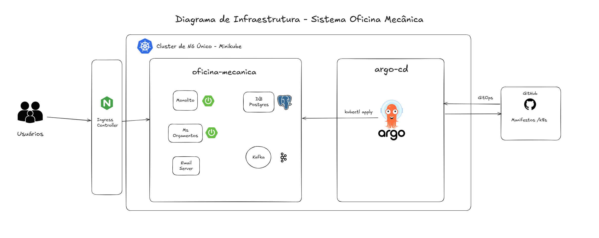
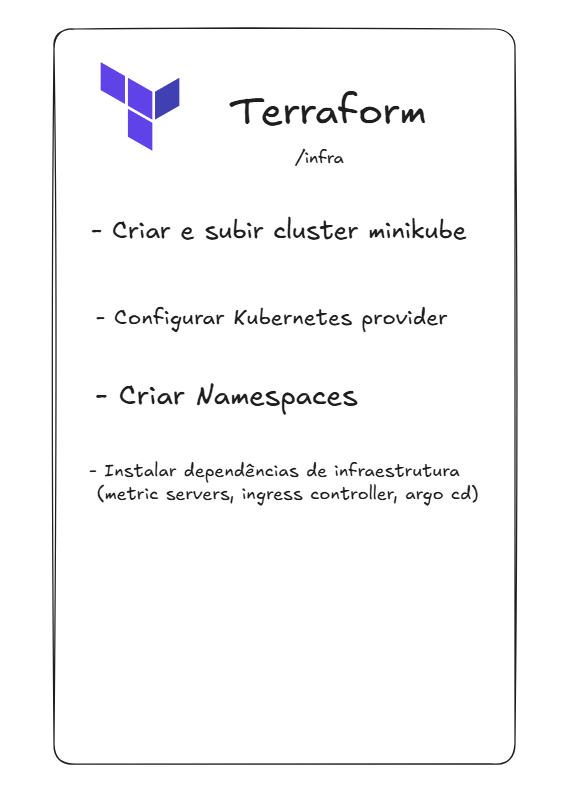

# Diagrama de Infraestrutura - Fase 2 - Arquitetura Kubernetes

------------------------------------------------- 

## Terraform - Provisionamento IaC

--------------------------------------------------

### Planejamento

**Terraform**:

- Minikube
- Namespace
- Metrics Server
- Ingress NGINX

**Kubernetes**:
- PostgreSQL
- Kafka Budget Approval Request
- Kafka Budget Decision
- Serviço Oficina Mecânica (monolito)
- Serviço Orçamento (microsserviço)
- Serviço de Email
- ArgoCD

**CI / CD**:

- Build
- Testes
- SonarCloud
- Docker Build
- Push para Registry
- Atualização GitOps