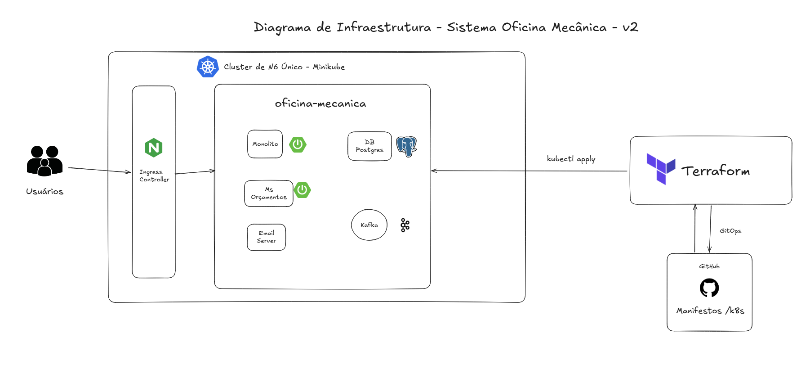
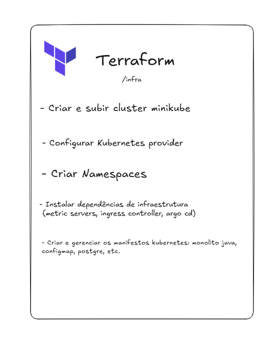

## Contexto

Após a idealização da infraestrutura contendo o ArgoCD para gerenciamento de manifestos Kubernetes via CI / CD ([Desenho de arquitetura - v1](../v1/Diagrama-Infraestrutura-fase2.png)), tiramos algumas dúvidas com os professores, e fomos orientados a utilizar o **Terraform** como ferramenta centralizadora de infraestrutura, gerenciando assim todos os manifestos kubernetes por meio de **recursos** do terraform. Dessa forma, atualizamos o *diagrama de infraestrutura* desta fase.

# Diagrama de Infraestrutura - Fase 2 - V2

## Terraform - provisionamento IaC

