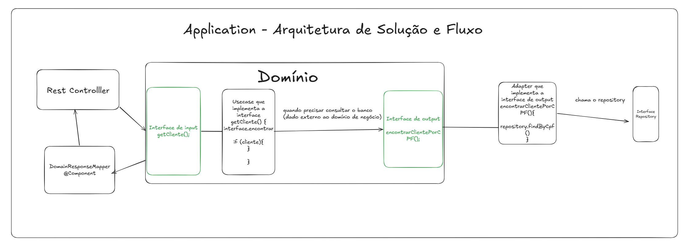

# ADR001 - Arquitetura Código Java e DDD - Fase 1

- **Número da ADR**: 0001  
- **Data**: 20 de abril de 2026  
- **Autor**: Andre Lui  
- **Status**: **Aceita**

---

## Contexto

O sistema da oficina mecânica está sendo desenvolvido como um backend em Java utilizando Spring Boot, com foco em Domain-Driven Design (DDD).

Desde o início do projeto (MVP), identificou-se a necessidade de uma arquitetura que:

- Separe claramente regras de negócio de detalhes técnicos
- Garanta baixo acoplamento com frameworks (Spring) e banco de dados
- Permita evolução futura para arquiteturas distribuídas
- Facilite testes unitários e manutenção do código
- Mantenha organização alinhada aos agregados do domínio

Os principais contextos do domínio são:

- Cliente
- Veículo
- Ordem de Serviço
- Orçamento
- Insumo
- Serviço

Dado esse cenário, optou-se por uma arquitetura que privilegia o isolamento do domínio como elemento central da aplicação.

---

## Decisão

Adotar a **Arquitetura Hexagonal (Ports and Adapters)** como padrão principal para organização do código do projeto.

A arquitetura será baseada nos seguintes princípios:

- Domínio isolado e independente (Java puro)
- Comunicação com o mundo externo via portas (interfaces)
- Implementação dessas portas por adaptadores
- Separação clara entre regras de negócio, infraestrutura e interfaces externas

---

### Estrutura de pastas proposta

```plaintext
src/main/java/com/oficina

├── domain
│   ├── cliente
│   │   ├── model
│   │   │   └── Cliente.java
│   │   └── usecase
│   │       ├── ClienteUseCase.java
│   │       └── ClienteUseCaseImpl.java
│   │
│   ├── veiculo
│   ├── ordemservico
│   ├── orcamento
│   ├── insumo
│   └── servico
│
├── port
│   ├── cliente
│   │   ├── ClienteInputPort.java
│   │   └── ClienteOutputPort.java
│   │
│   ├── veiculo
│   ├── ordemservico
│   ├── orcamento
│   ├── insumo
│   └── servico
│
├── adapter
│   ├── input
│   │   ├── cliente
│   │   │   ├── controller
│   │   │   │   └── ClienteController.java
│   │   │   └── mapper
│   │   │       └── ClienteMapper.java
│   │   │
│   │   ├── veiculo
│   │   ├── ordemservico
│   │   ├── orcamento
│   │   ├── insumo
│   │   └── servico
│   │
│   └── output
│       ├── cliente
│       │   ├── ClienteAdapter.java
│       │   └── persistence
│       │       ├── entity
│       │       │   └── ClienteEntity.java
│       │       └── repository
│       │           └── ClienteRepository.java
│       │
│       ├── veiculo
│       ├── ordemservico
│       ├── orcamento
│       ├── insumo
│       └── servico
│
├── config
│   └── BeanConfiguration.java
│   └── SecurityConfig.java
│   └── ...
```

---

### Fluxo da aplicação

Fluxo padrão de execução:

1. Controller (adapter/input) recebe requisição externa
2. Controller chama uma porta de entrada (Input Port)
3. Use Case (domain) executa a regra de negócio
4. Use Case utiliza uma porta de saída (Output Port)
5. Adapter (adapter/output) implementa a porta e acessa infraestrutura
6. Resultado retorna ao controller e ao cliente



---

## Justificativa

### 1. Aderência ao Domain-Driven Design (DDD)

A arquitetura garante:

- Isolamento completo do domínio
- Centralização das regras de negócio
- Separação clara por contextos (agregados)

O domínio se torna independente de detalhes técnicos, conforme recomendado pelo DDD.

---

### 2. Isolamento do domínio

O pacote `domain`:

- Não depende de frameworks
- Não possui anotações do Spring
- Contém apenas regras de negócio

Isso garante:

- Alta coesão
- Baixo acoplamento
- Facilidade de manutenção

---

### 3. Desacoplamento de infraestrutura

A utilização de portas e adaptadores permite:

- Trocar banco de dados sem impacto no domínio
- Trocar framework sem reescrever regras de negócio
- Evoluir a infraestrutura de forma independente

---

### 4. Testabilidade

A arquitetura permite:

- Testes unitários isolados do domínio
- Uso de mocks para portas de saída
- Execução de testes sem dependência de banco ou framework

---

### 5. Preparação para evolução futura

Mesmo sendo um MVP, a arquitetura:

- Facilita transição para microsserviços
- Permite adoção de mensageria (ex: Kafka)
- Suporta crescimento do sistema sem reestruturação completa

---

### 6. Clareza e organização

A separação em:

- `domain`
- `port`
- `adapter`
- `config`

torna explícito:

- O que é regra de negócio
- O que é infraestrutura
- O que é interface externa

---

### 7. Alinhamento com Clean Architecture

A decisão segue princípios como:

- Dependency Inversion Principle
- Separation of Concerns
- Independência do domínio

---

## Consequências

### Consequências Positivas

- Forte isolamento do domínio
- Baixo acoplamento com frameworks
- Alta testabilidade
- Melhor organização por contexto
- Facilidade de evolução futura
- Código mais sustentável a longo prazo

---

### Consequências Negativas

- Aumento de complexidade inicial
- Maior quantidade de código (interfaces, adapters)
- Curva de aprendizado para equipe
- Necessidade de disciplina arquitetural

---

## Alternativas Consideradas

### 1. Arquitetura MVC tradicional

**Prós:**
- Simples
- Fácil de implementar

**Contras:**
- Alto acoplamento com framework
- Mistura regras de negócio com infraestrutura

❌ Rejeitada por não atender aos requisitos de isolamento do domínio.

---

### 2. Arquitetura em camadas tradicional

**Prós:**
- Amplamente conhecida
- Simples organização

**Contras:**
- Baixa coesão por domínio
- Mistura diferentes contextos

❌ Rejeitada por dificultar evolução e manutenção.

---

### 3. Vertical Slice Architecture

**Prós:**
- Organização por caso de uso
- Alta coesão funcional

**Contras:**
- Menor foco no isolamento do domínio
- Pode misturar infraestrutura com lógica de negócio

❌ Rejeitada como padrão principal.

---

## Implementação

### Passos:

1. Criar estrutura base de pacotes (domain, port, adapter, config)
2. Definir modelos de domínio (sem dependências externas)
3. Criar interfaces de entrada e saída (ports)
4. Implementar use cases no domínio
5. Criar controllers (input adapters)
6. Criar adapters de saída (persistência)
7. Implementar mapeamentos (DTO ↔ Domain)
8. Configurar injeção de dependência via Spring
9. Criar testes unitários para o domínio

---

## Referências

- Domain-Driven Design — Eric Evans  
- Clean Architecture — Robert C. Martin  
- Hexagonal Architecture — Alistair Cockburn  
- Ports and Adapters Pattern  
- SOLID Principles  

---

## Links úteis:

- https://alistair.cockburn.us/hexagonal-architecture/  
- https://8thlight.com/blog/uncle-bob/2012/08/13/the-clean-architecture.html  
- https://martinfowler.com/bliki/HexagonalArchitecture.html  
- https://docs.spring.io/spring-boot/docs/current/reference/html/  