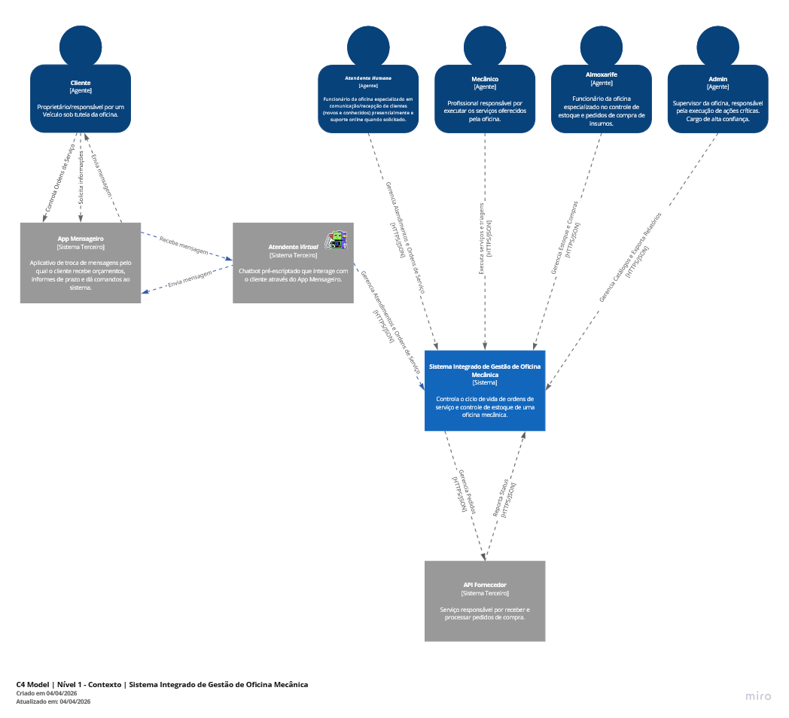
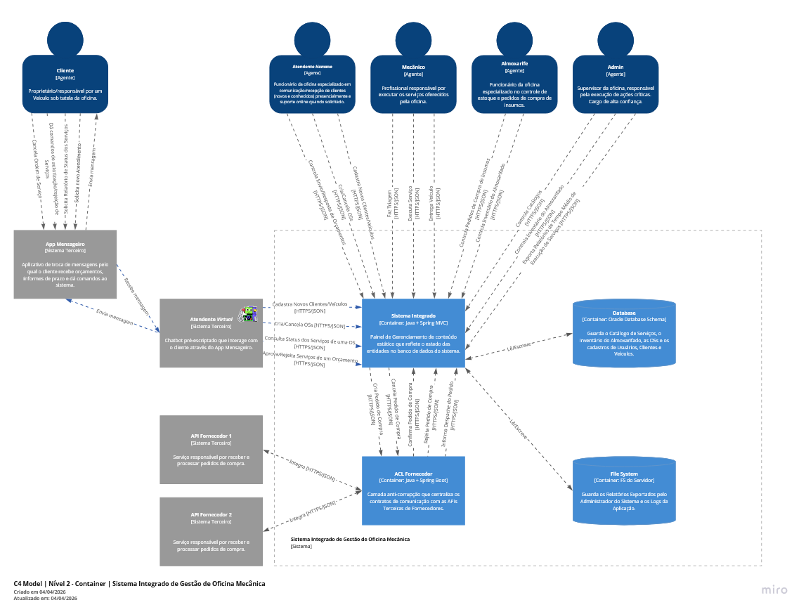

# C4 Model

Todos os diagramas anexados aqui foram criados no [Miro](https://miro.com/app/board/uXjVGww4GU4=/?moveToWidget=3458764666481882428&cot=14).

## Premissas

- O executável é apenas um MVP que foca nas partes críticas do modelo de negócio, visando solucionar problemas de 
  comunicação, evitar gargalos processuais e melhorar a supervisão geral dos serviços prestados pela oficina.
- Não existirá um aplicativo mobile ou painel de auto-atendimento para o Cliente, ao invés disso, o sistema contará com 
  um chatbot que atende a essas necessidades de comunicação e processamento de inputs do Cliente.
- A integração com os sistemas de compra dos Fornecedores é feita através de APIs REST cujo contrato é previamente 
  conhecido pelo time.
- O Banco de Dados da aplicação será monolítico, tal qual o sistema em si, baseado em PostgreSQL.
- Os relatórios e logs de execução da aplicação serão salvos diretamente em disco.
- O sistema não contará com área não-logada, sendo obrigatório fazer autenticação para utilizá-lo.
- O sistema trabalhará com 
  [Session Tokens](https://cheatsheetseries.owasp.org/cheatsheets/Session_Management_Cheat_Sheet.html), que expiram em 
  poucos minutos, servindo como uma camada extra de proteção contra ataques. O tempo exato de expiração ainda precisa 
  ser discutido.
- O sistema contará tanto com uma API REST para uso do Chatbot e Webhooks de Sistemas Terceiros, quanto com um painel 
  administratvo SSR (Server-side Rendered) para uso interno dos funcionários.

## Nível 1 - Contexto

> Mostra o sistema como uma caixa preta, estabelecendo os papeis dos agentes mais importantes e a visão geral do uso 
  que o sistema terá.

Legenda:

| Elemento         | Cor/Forma                 | Significado                                |
|------------------|---------------------------|--------------------------------------------|
| Agente           | Boneco (azul)             | Ator humano que interage com o sistema     |
| Sistema          | Retângulo                 | O sistema sendo desenvolvido               |
| Sistema externo  | Retângulo (cinza)         | Sistema fora do controle do time           |
| Seta             | Linha tracejada com texto | Direção da interação principal + protocolo |

## Nível 2 - Container

> Primeiro nível de "zoom" nos detalhes do sistema, mostrando o primeiro nível das unidades implantáveis e suas 
  relações. Destaque aqui para a ACL (Camada anti-corrupção), que media a comunicação entre o executável principal e os 
  sistemas dos fornecedores.

Legenda:

| Elemento         | Cor/Forma                      | Significado                                       |
|------------------|--------------------------------|---------------------------------------------------|
| Agegente         | Boneco (azul)                  | Ator humano que interage com o sistema            |
| Container        | Retângulo interno (azul)       | Unidade implantável - aplicação ou infraestrutura |
| Banco de Dados   | Cilindro (azul)                | Armazenamento Persistente                         |
| Sistema externo  | Retângulo externo (cinza)      | Sistema fora do controle do time                  |
| Seta             | Linha tracejada com texto      | Direção da interação principal + protocolo        |
| Limites          | Retângulo tracejado envolvente | Fronteira do Sistema                              |

## Nível 3 - Componentes

TODO: criar diagrama do nível 3

## Nível 4 - Código

TODO: criar diagrama do nível 4
