# Domain Storytelling

Todos as histórias anexadas aqui foram criados no [Miro](https://miro.com/app/board/uXjVGww4GU4=/?moveToWidget=3458764665077764499&cot=14).

## Histórias de Cadastro

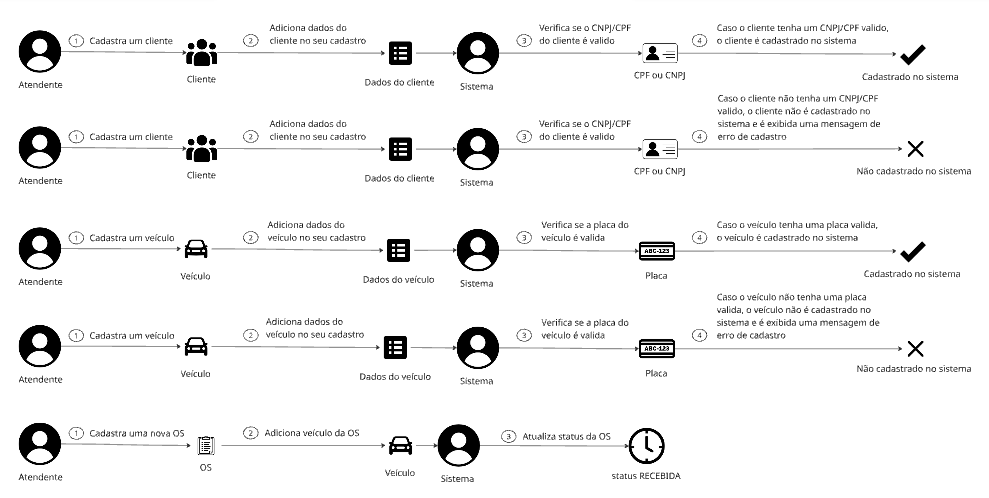
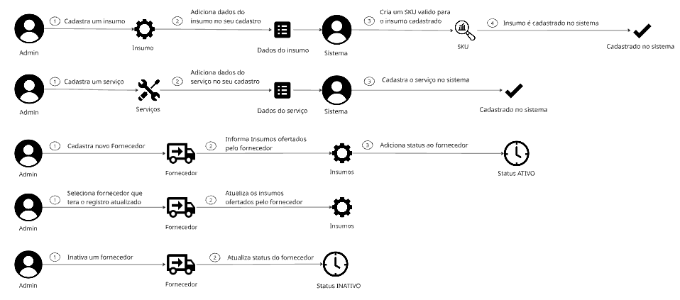

Vale notar que algumas das histórias de cadastro tem algumas validações, como a de cadastrar veículos e clientes que verifica a placa do veículo e o CPF/CNPJ, respectivamente, e que os atores que fazem as ações de cadastro são apenas o admin e atendende.

## Histórias de Atualização de OS

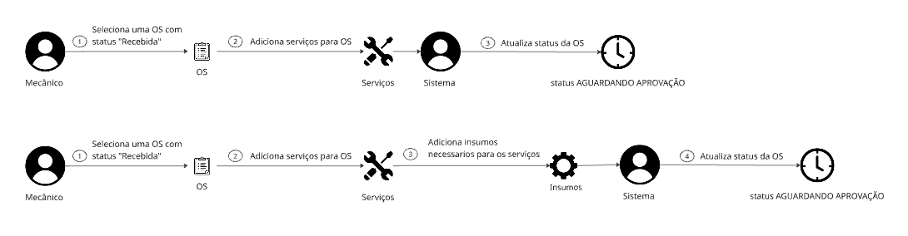

## História onde Cliente Cancela a OS

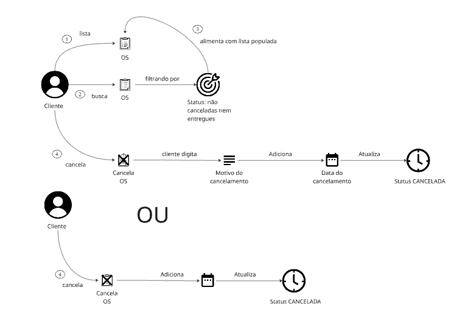

## Histórias do Orçamento

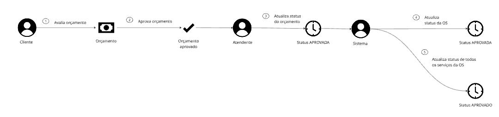
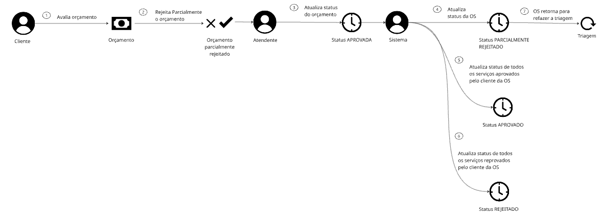
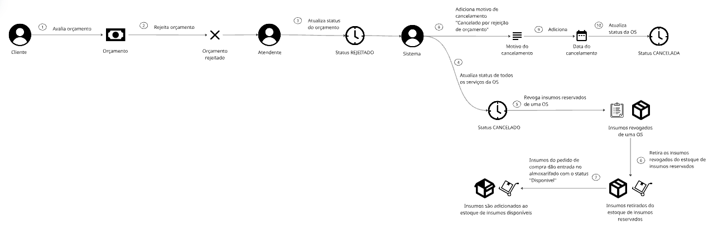

## Histórias da Triagem

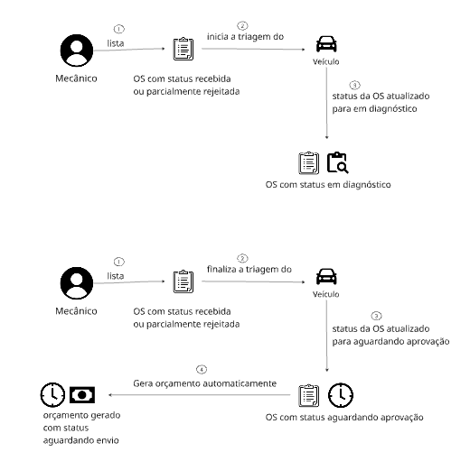

## História de Adicionar Serviço Adicional na OS

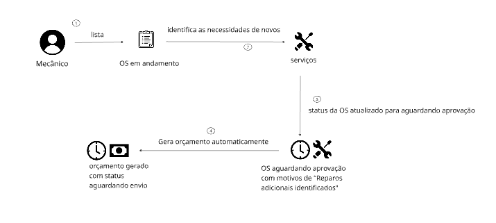

## História de Entrega de Veículo

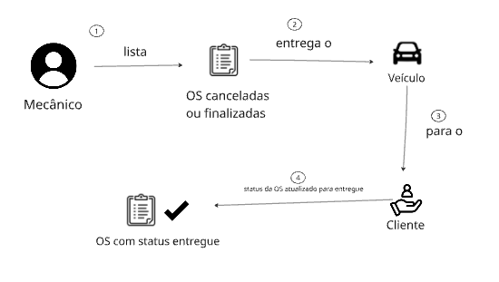

## Histórias de Serviço

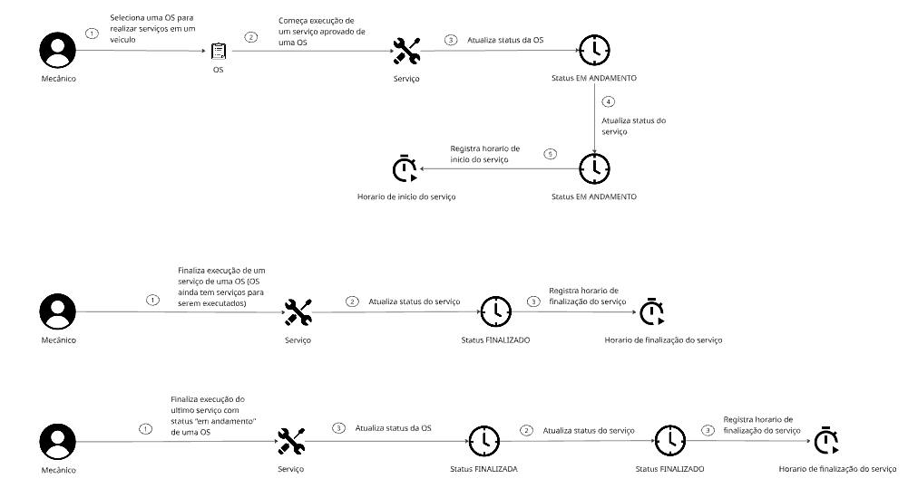

## História de Tempo Médio de Serviço

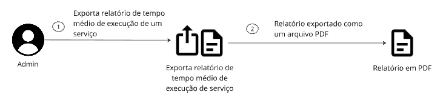

Esse relatório é gerado com base no tempo de inicio e término de um serviço, por exemplo, se eu tenho o serviço check-up, esse relatório gerado será com o tempo médio em dias em que o serviço check-up é concluido em um veículo, tomando como base o tempo médio de todos os serviços desse tipo que ja foram executados em um veículo.

## Histórias do Almoxarifado

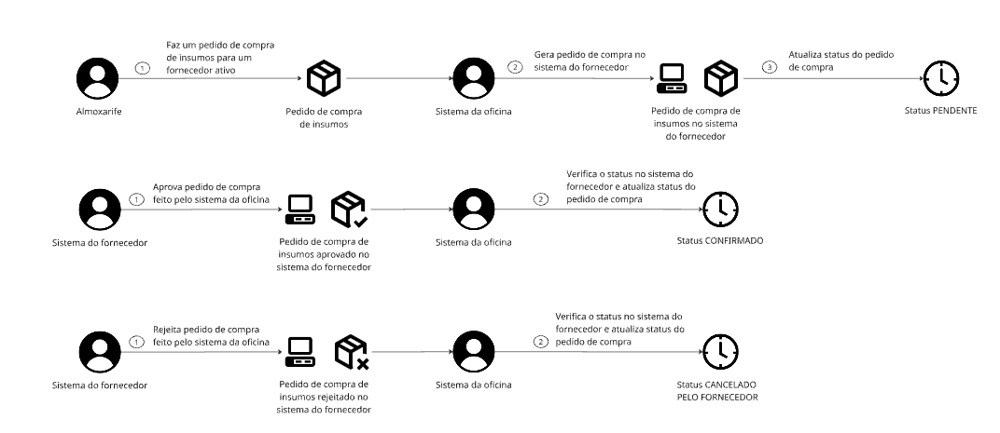
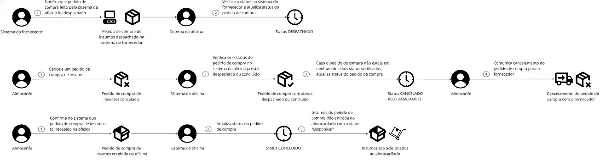
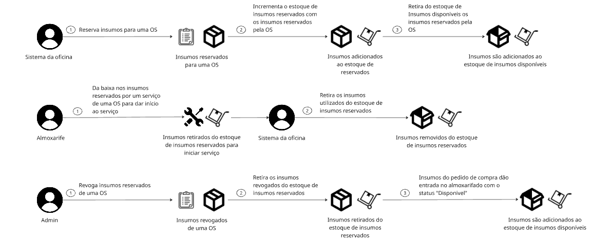

Essas histórias se tratam de todo tipo de controle de estoque no sistema, desde os pedidos de compra para fornecedores até dar baixa em insumos reservados após serem utilizados em um serviço.