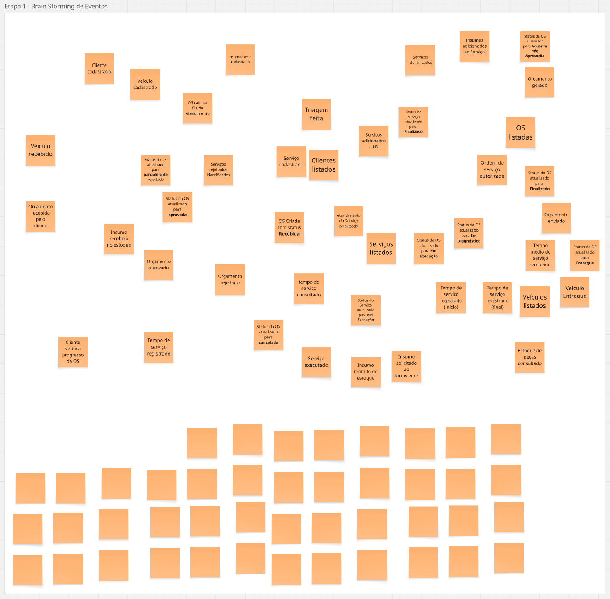
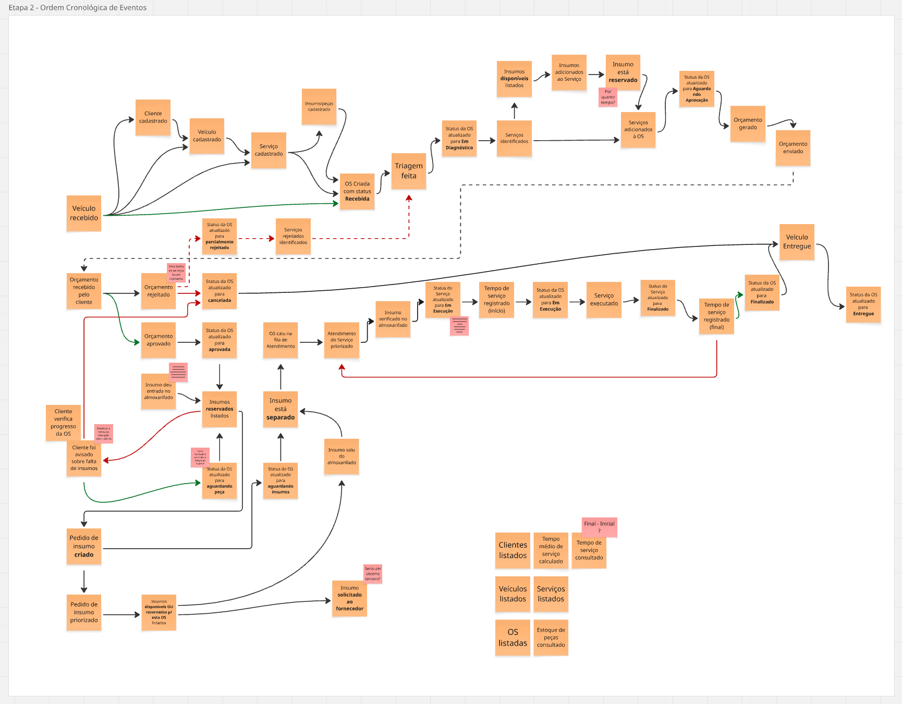
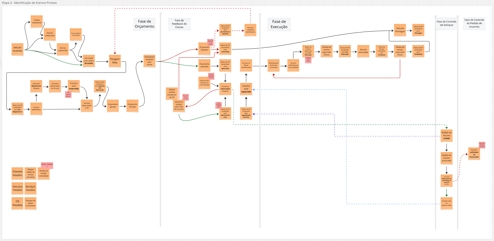
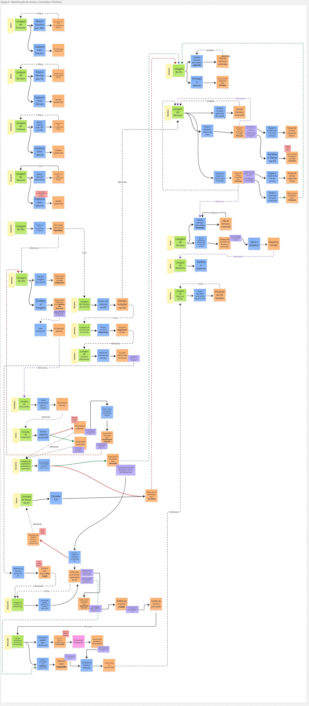
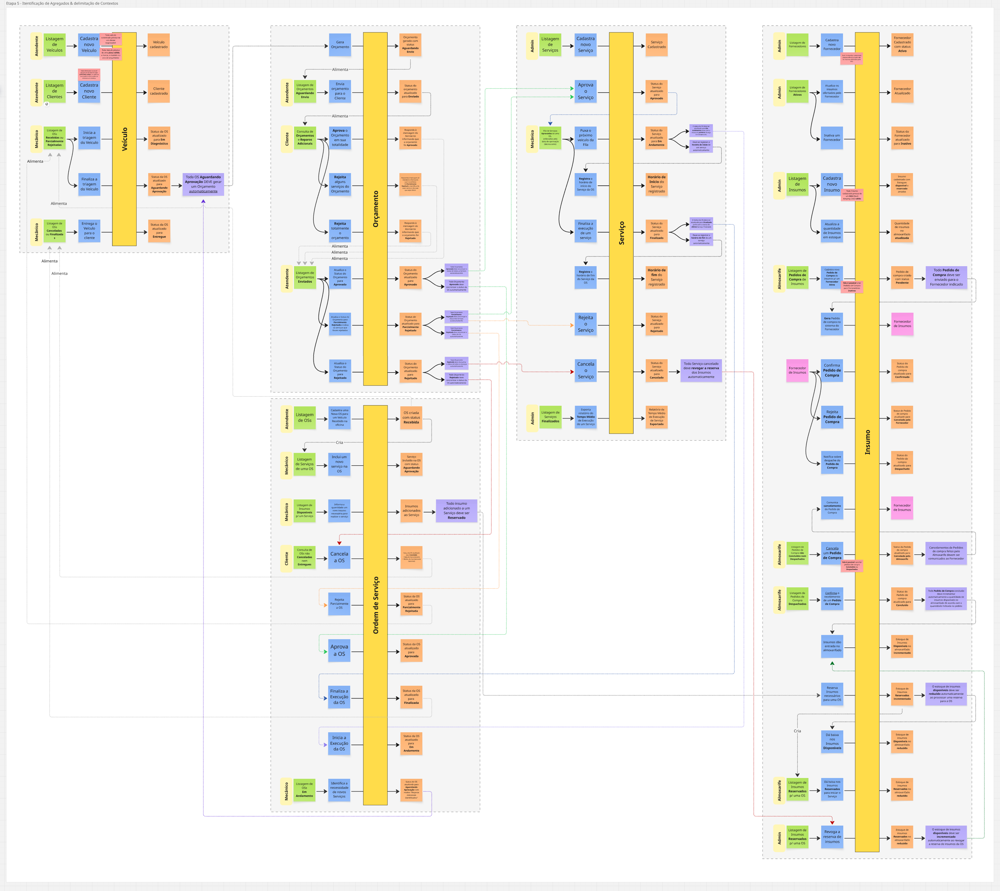

# Event Storming

Todos os diagramas anexados aqui foram criados no [Miro](https://miro.com/app/board/uXjVGww4GU4=/?moveToWidget=3458764665077764499&cot=14).

## Etapa 1 - Brain Storming

Nós abrimos a reunião com um "brain storming" em que todos os envolvidos foram sugerindo eventos que ocorrem numa 
oficina mecânica. O objetivo dessa etapa é documentar de forma sucinta ações em tempo passado, sem necessariamente 
considerar a existência de um sistema. O objetivo era criar um panorama geral do Negócio puro.

## Etapa 2 - Ordem cronológica de Eventos

Em seguida, nós organizamos esses eventos em uma linha cronológica e começamos a documentar dúvidas e restrições.

## Etapa 3 - Identificação de Eventos Pivotais

Com a linha cronológica montada, nós identificamos as "fases" do negócio; que são delimitadas pelos eventos pivotais.

## Etapa 4 - Identificação de Atores, Comandos e Políticas

Aqui nós começamos a identificar e nomear os atores envolvidos no processo da oficina. Bem como os modelos de leitura, 
que podem ser interpretados como uma interface humano-computador. Os comandos, que são as ações automáticas ou manuais 
que antecedem um evento de negócio. E as políticas, que servem para encadear comandos e eventos, representando assim as 
oportunidades de automação do futuro sistema.

## Etapa 5 - Identificação de Agregados e delimitação de Contextos

Por fim, nós identificamos 5 Agregados:

- Veículo: que cuida de toda a parte de cadastro, recebimento, triagem e devolução de um veículo na oficina.
- Orçamento: que engloba a automação de orçamentos a partir de OSs aguardando aprovação do cliente (pós triagem).
- Ordem de Serviço: que contempla todo o ciclo de vida, desde a recepção do veículo na oficina até a finalização dos 
  serviços.
- Serviço: focado especificamente no controle de tempo de execução de cada serviço.
- Insumo: que cuida de toda a parte de almoxarifado, indo do inventário ao gerenciamento de pedidos de compra em 
  sistemas terceiros.
