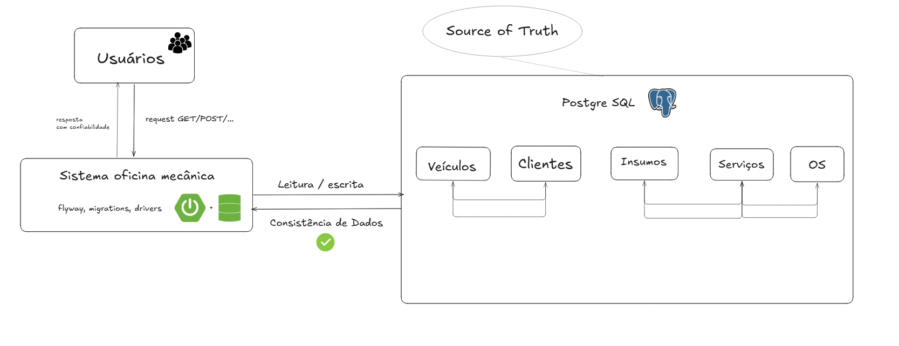

# RFC001 - Escolha do banco de dados PostgreSQL

- **Número da RFC**: 0001  
- **Data**: 13 de abril de 2026  
- **Autor**: Andre Lui
- **Status**: **Aceita**

---

## Resumo

Esta RFC propõe a adoção do PostgreSQL como banco de dados principal para o sistema de gerenciamento de oficina mecânica. A decisão prioriza consistência forte, integridade relacional e confiabilidade, alinhando-se às necessidades do domínio de negócio e aos princípios de arquitetura orientada a domínio (DDD), além de considerar os trade-offs dos teoremas CAP e PACELC.

---

## Contexto

O sistema em desenvolvimento é responsável pelo gerenciamento de uma oficina mecânica, contemplando agregados como:

- Ordem de Serviço  
- Serviço  
- Insumo  
- Veículo  
- Usuários (Cliente, Atendente, Mecânico, Almoxarife, Admin)

Esse domínio apresenta características importantes:

- Alta dependência de consistência de dados (ex: status de ordem de serviço, consumo de insumos, vínculo com veículos e clientes)
- Modelo altamente relacional
- Baixo a moderado volume de concorrência, mesmo em cenários de pico (10–12 veículos/dia)
- Necessidade de rastreabilidade e integridade transacional

Além disso, o sistema poderá utilizar futuramente event streaming com Kafka, introduzindo consistência eventual em partes específicas da arquitetura (event-driven), mas não no core transacional.

---

## Proposta

Adotar o PostgreSQL como banco de dados relacional principal da aplicação.

### Características da solução:

- Banco relacional (SQL)
- Suporte completo a ACID
- Forte suporte a integridade referencial
- Capacidade de modelar bem agregados do DDD
- Suporte a extensões (ex: JSONB, indexação avançada)

### Papel na arquitetura:

- Fonte de verdade (source of truth) para os dados transacionais
- Persistência dos agregados principais
- Possibilidade de integração com mensageria (Kafka) para propagação de eventos

---

## Justificativa

### 1. Adequação ao domínio (DDD)

O domínio da oficina é fortemente relacional, com regras claras entre entidades:

- Ordem de Serviço ↔ Veículo  
- Ordem de Serviço ↔ Serviços ↔ Insumos  
- Usuários com papéis distintos  

Bancos relacionais como PostgreSQL se destacam nesse cenário por:

- Garantir integridade referencial
- Facilitar consistência de agregados
- Evitar anomalias de escrita/leitura

---

### 2. Teorema CAP

O PostgreSQL, em sua configuração tradicional, prioriza:

- C (Consistency) → dados sempre corretos e sincronizados  
- A (Availability) → alta disponibilidade local  
- P (Partition tolerance) → limitada (não é distribuído por padrão)

No contexto da oficina:

- A prioridade é consistência, não latência extrema
- Uma inconsistência (ex: OS com dados errados) impacta diretamente o negócio
- O sistema não exige disponibilidade global distribuída

Portanto, a escolha favorece CP (Consistency over Availability em cenários de falha).

---

### 3. Teorema PACELC

PACELC define:

- Em caso de partição (P): escolhe-se entre A ou C  
- Caso contrário (E): escolhe-se entre Latência (L) ou Consistência (C)

No PostgreSQL:

- Em falhas → prioriza consistência (C)
- Em operação normal → prioriza consistência sobre latência (C > L)

Para o sistema:

- Latência baixa é desejável, mas não crítica
- Consistência é essencial

Escolha alinhada: PC/EC.

---

### 4. Consistência forte vs eventual

- PostgreSQL → consistência forte (ACID)
- Kafka (eventos) → consistência eventual

Estratégia adotada:

- Core transacional → forte consistência  
- Integrações/eventos → eventual  

---

### 5. SQL vs NoSQL

#### SQL (PostgreSQL)

Melhor para:

- Dados estruturados  
- Relacionamentos complexos  
- Transações críticas  

#### NoSQL

Melhor para:

- Alta escala distribuída  
- Dados semi-estruturados  
- Baixa necessidade de consistência forte  

Neste sistema:

- Relacionamentos são centrais  
- Regras de negócio dependem de consistência  
- Escala não é massiva  

Portanto, NoSQL não é a melhor escolha como banco principal.

---

### 6. Pensamento arquitetural

A decisão segue princípios importantes:

- Escolher o banco pelo problema, não pela tecnologia
- Evitar overengineering
- Priorizar simplicidade com capacidade de evolução

PostgreSQL permite:

- Escalar verticalmente e horizontalmente (replicação)
- Evoluir para arquiteturas híbridas
- Manter robustez sem complexidade desnecessária

---

## Impactos

### Impacto na Arquitetura

- Adoção de arquitetura transacional consistente
- Separação clara entre:
  - Persistência (PostgreSQL)
  - Mensageria (Kafka)
- Facilita padrões como:
  - Repository (DDD)
  - Unit of Work

---

### Impacto nos Processos

- Necessidade de modelagem relacional cuidadosa
- Uso de migrations (Flyway/Liquibase)
- Garantia de integridade via constraints

---

### Impacto nos Recursos

- Necessidade de:
  - Instância PostgreSQL
  - Monitoramento de performance
  - Estratégia de backup

Baixo custo operacional comparado a soluções distribuídas complexas.

---

## Alternativas Consideradas

### 1. MongoDB (NoSQL)

**Prós:**
- Flexibilidade de schema
- Escalabilidade horizontal

**Contras:**
- Consistência eventual por padrão
- Dificuldade com relações complexas
- Risco de inconsistência de dados críticos

Rejeitado por não atender bem o domínio.

---

### 2. MySQL

**Prós:**
- Similar ao PostgreSQL
- Amplamente utilizado

**Contras:**
- Menor flexibilidade em recursos avançados
- Inferior em extensibilidade e tipos avançados

Rejeitado por menor aderência a cenários complexos.

---

### 3. Banco distribuído (Cassandra, etc.)

**Prós:**
- Alta disponibilidade
- Escala massiva

**Contras:**
- Consistência eventual
- Complexidade operacional alta
- Overkill para o cenário

Rejeitado por excesso de complexidade.

---

## Implementação

### Passos:

1. Configurar PostgreSQL no ambiente  
2. Integrar com Spring Boot (Spring Data JPA)  
3. Modelar entidades baseadas nos agregados do DDD  
4. Criar migrations (Flyway ou Liquibase)  
5. Configurar transações (ACID)  
6. Implementar repositórios  
7. Integrar com Kafka para eventos assíncronos, caso necessário 
8. Monitorar performance e ajustar índices  

---

## Referências

- Teorema CAP (Brewer)  
- Teorema PACELC  
- Domain-Driven Design (Eric Evans)  
- Arquitetura Orientada a Eventos  
- Vídeo: Renato Augusto — Escolha de Banco de Dados 
- Diagrama Miro (link fornecido)  

---

## Links úteis:

- https://miro.com/app/board/uXjVJCL6b64=/
- https://www.youtube.com/watch?v=bhw4-Kq_RPs
- https://www.postgresql.org/docs/  