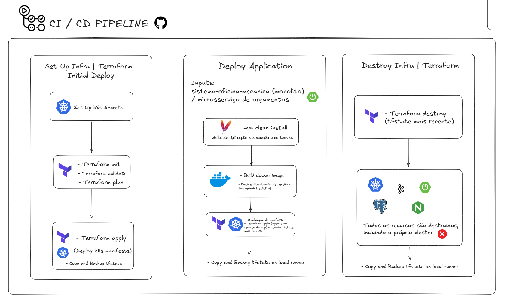

# Diagrama de CI / CD - Fase 2

## Contexto, detalhes de implementação e decisão

Durante a análise de requisitos técnicos e itens entregáveis da Fase 2, optamos por formular uma arquitetura que funcione **localmente** utilizando um cluster Minikube, conforme mostrado no [Diagrama de Infraestrutura da Fase 2](../infra/v2/Diagrama-Infra-v2.png).

Dado este cenário, decidimos fazer **3 workflows (esteiras)** *diferentes*, considerando que o nosso runner já está configurado com todas as ferramentas necessárias.

A decisão tomou como pressuposto o fato de que a criação e manipulação do ambiente é feita majoritariamente pelo **terraform**, o que nos leva a definir 3 caminhos de automação:

- 1- Set Up Infra | Initial Deploy:

    O primeiro workflow dá o ponto de partida para o início do fluxo, ele é quem irá provisionar todos os recursos necessários do ambiente local. Nesse workflow e também em outros, vamos utilizar a prática "GitOps", onde todos os manifestos que estão em ["k8s/"](../../k8s/) servirão como a nossa fonte da verdade para o cluster Kubernetes.

    Dito isso, o primeiro passo para este workflow é realizar a **substituição de secrets** no manifesto *"secret.yaml"* via secrets do GitHub Actions. Isso ocorre pois no repositório nós **não teremos** os valores das secrets diretamente commitados, mas sim apenas valores fixos *"placeholders"*.

    Feita a substituição, vamos **aplicar** os recursos do terraform. O apply irá provisionar tanto o Cluster Minikube, quanto os namespaces e dependências necessárias para o funcionamento da infraestrutura, bem como a aplicação dos manifestos Kubernetes dentro dele - isso é o que chamaremos de "Initial Deploy" - pois neste workflow, além de provisionar toda a infraestrutura, também aplicaremos as versões atuais de cada aplicação e recurso do cluster, inclusive o banco de dados.

    Por fim, vamos copiar o arquivo *tfstate* e guardá-lo no runner, a fim de reutilizá-lo nos outros workflows (lembrando que tudo terá o terraform envolvido). 
    
    A estratégia de **guardar o tfstate** foi pensada para termos sempre uma **referência** do estado da infraestrutura local, de modo que o terraform possa rastrear todas as mudanças e gerenciar todos os recursos corretamente. Por isso, o "backup" do tfstate será utilizado em **todos** os workflows a cada vez que uma mudança é aplicada.

- 2- Deploy Application:

    O segundo workflow foi pensado exclusivamente no conceito e implementação de **CI / CD** para o projeto. Resumidamente, o objetivo dele é **atualizar** os manifestos Kubernetes que definem a aplicação monolítica da Oficina Mecânica ou o Microsserviço de Orçamentos. Por isso, o workflow receberá um **input**, perguntando se o deploy que será feito será da aplicação monolítica ou do microsserviço. Uma vez que escolhida uma das opções, o caminho será quase o mesmo para ambos os casos: vamos buildar a aplicação, construir uma **imagem docker** para ela e publicar no **registry**, que no caso é o dockerhub. A cada execução do workflow será feito um versionamento da imagem, de modo que ela seja atualizada e publicada logo em seguida no dockerhub. 

    Ao atualizar a versão da imagem e publicar no registry, vamos **trocar a versão** no manifesto k8s da aplicação escolhida, e logo em seguida **aplicar as mudanças** pelo terraform. Com isso, conseguimos **fazer deploy** continuamente a cada vez que alguma aplicação tem alterações. É importante ressaltar que neste workflow o terraform será responsável apenas por mudar o **recurso da aplicação**, e nada mais além dele.

    Por fim, seguimos a mesma lógica de **armazenar e preservar o tfstate atualizado** depois dessas mudanças.

- 3- Destroy Infra | Terraform

    Como o nome sugere, o terceiro e último workflow que pensamos será utilizado exclusivamente para desprovisionar (ou então excluir) **todos os recursos**. Isso significa que ele pode **deletar** todos os recursos dentro do cluster e inclusive o próprio cluster Kubernetes de modo automático, encerrando assim o fluxo e o ciclo de vida da infraestrutura e das aplicações. Uma vez que tudo for excluído, poderá ser provisionado novamente a partir do primeiro workflow de Set Up Infra, resetando o ambiente e continuando o ciclo de automação posteriormente. É importante lembrar que mesmo após destruirmos todos os recursos, o **tfstate** ainda será guardado e atualizado no runner local.

## Conclusão

Elaboramos essa arquitetura de solução pensando no cenário mais adequado para o nosso caso, seguindo as **boas práticas** de segurança, e levando em conta a **separação clara de responsabilidades**, bem como a implementação de CI / CD de forma definida e sequencial para atender todos os itens exigidos nesta fase.